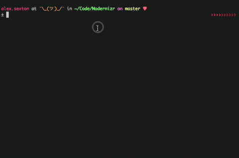

# 

  # Cifralex 🔎 
  Es una aplicación diseñada para ocultar y revelar mensajes entre amigas.

  # ¿Cómo funciona?
  Sólo necesitas un mensaje a ocultar o revelar y el respectivo número favorito, ya sea tuyo o de tu amiga.  🧚‍♀️ 🧚‍♀️git  ¡Recuerda que sólo tu número favorito podrá descifrar tu mensaje!
  
  # El proceso de diseño...
  El proceso elegido para diseñar Cifralex fue con sketchs y prototipos de diseño, elegimos hacer varios sketchs manteniéndolos simples y claros para corregir errores a tiempo.

  Los tests fueron realizados en loom con usuarios una vez teniendo la base de la app.

   ## Ejemplo de test:
  https://www.useloom.com/share/7e97f7fa086a4ac79e64eec1834d57b7

  

  # Por ejemplo
  Cuando estás secreteando con tu mejor amiga y no quieres que los demás sepan de qué o quién estás hablando, puedes cifrar tu mensaje o nombre para que sólo ustedes sepan de lo que hablan.

  # Principales Usuarios
  Niñas entre 9-14 años.

  # Objetivos
  Proporcionar un poco de entretención y sentido de privacidad entre niñas pequeñas.

  # Problemas que resuelve
  Resuelve posibles conflictos entre compañeros al poder, de una manera segura, enviar mensajes secretos. 
  
  .
  .
  .
  .
  
## Programado en
   Vanilla JavaScript.

## Trello
https://trello.com/b/XAjYJYh4

## Link directo para acceder a la app
  https://aleisabl.github.io/SCL008-Cipher/src/index.html
